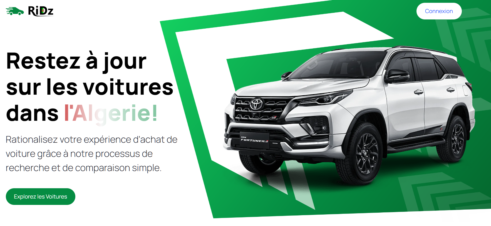

This is a [Next.js](https://nextjs.org/) project bootstrapped with [`create-next-app`](https://github.com/vercel/next.js/tree/canary/packages/create-next-app).

  
<h1 align="center">RiDz - Marché des Voitures 🚗</h1>

  A Web App to showcase, explore and learn more abour cars in the Algerian market. 

 <a href="#books-subjects">Subjects</a> • 
 <a href="#desktop_computer-demonstration">Demonstration</a> •
 <a href="#woman_technologist-achievements-difficulties-and-improvements">
  Achievements, difficulties and improvements
 </a>

## :books: Subjects

- HTML
- CSS
- Tailwind CSS
- JavaScript (Arrays, Objects, AJAX, DOM and Fetch API)
- Regex (Capturing groups, replace method and its use, backreferences)
- React (Components, Hooks and Context API)
- Next.js (SSR & CSR)
- Node.js (Backend)

## :desktop_computer: Demonstration
<h3 align="center">
 <a href="https://ri-dz.vercel.app/">Try it out</a> • 
</h3>

                                        |

## :man_technologist: Achievements, difficulties and improvements

- ✅ Achievements:

  - Building the project from scratch;
  - Project structure organization;
  - Handling search parameters in the URL;
  - Implementing multiple REST APIs for the backend;
  - Providing valuable feedback to the user;

- 🌧️ Difficulties:

  - Establishing a well-organized structure for the components and CSS;
  - Finding reliable information to present to the user;
  - Handling API responses and errors;

- ⚡ Improvements:

  - More user-friendly UI and styles.
  - Andding the ability to add more cars to the list.
  - Improving the responsiveness of the app.
  - Implementing Authentication and Authorization.
  - Adding the ability to purchase and a payment process.

  Made by
  <a align="center" href="https://www.linkedin.com/in/hicham-amari-a1050b276/">
    chabandou ⚡
  </a>

